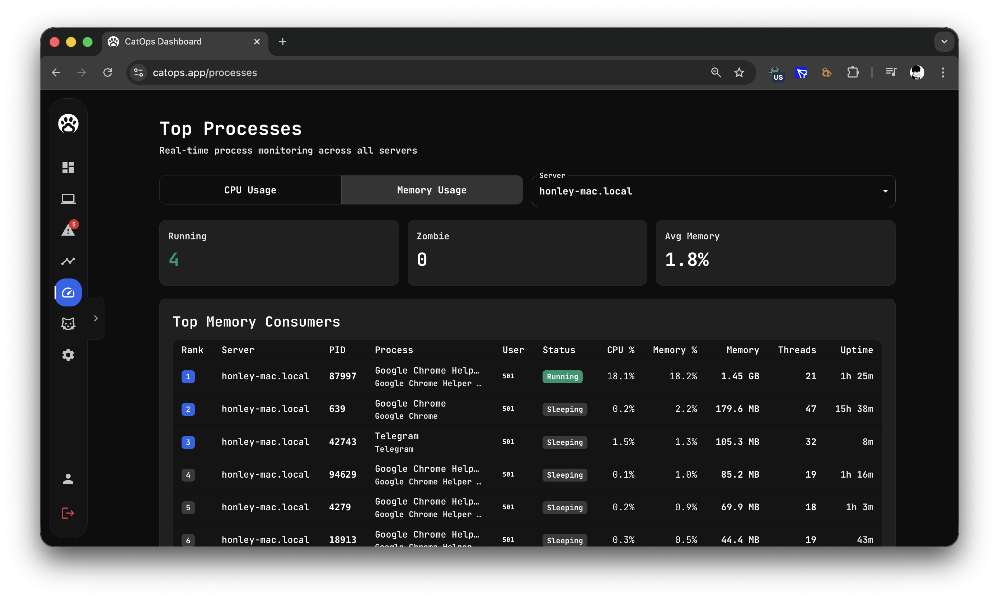
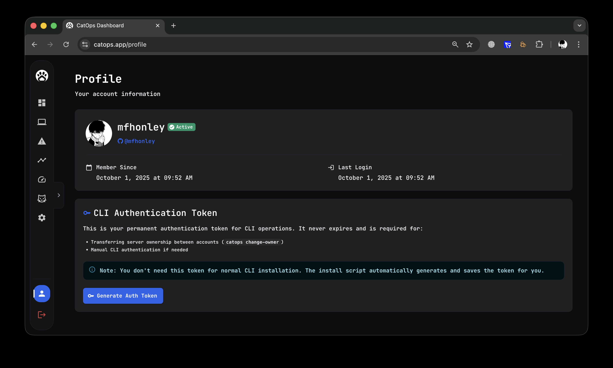

# CatOps

[](https://golang.org)
[](LICENSE)
[]()

**CatOps** is an ultra-lightweight server monitoring tool that sends real-time alerts and live stats straight to your Telegram group in seconds. One curl command, zero setup hell.

**Simple and flexible** - works offline or with web dashboard at [catops.app](https://catops.app)

```bash
# Install in seconds (from website)
curl -sfL https://get.catops.io/install.sh | bash

# Or from GitHub
git clone https://github.com/mfhonley/catops.git && cd catops && go build -o catops ./cmd/catops
```

## 🚀 Features

### Core Monitoring
- **System Metrics**: CPU, Memory, Disk, Network, I/O monitoring
- **Advanced Metrics**: IOPS, I/O Wait, HTTPS connections, process monitoring
- **Cross-platform Support**: Linux (systemd), macOS (launchd)
- **Kubernetes Support**: Native DaemonSet monitoring with optional Prometheus (200+ metrics)
- **Ultra-Lightweight**: Minimal resource footprint (~15MB binary)
- **Terminal UI**: Clean, color-coded terminal interface

### Alerting & Notifications
- **Telegram Integration**: Instant alerts via Telegram bot with remote commands
- **Configurable Thresholds**: Customizable CPU, Memory, and Disk limits
- **Alert System**: Configurable threshold-based notifications


### System Management
- **Background Service**: Daemon mode with auto-start capabilities
- **Process Monitoring**: Top processes by resource usage with detailed information
- **Service Control**: Start, restart, and status commands
- **Auto-start Management**: Systemd/launchd/Task Scheduler service creation and management
- **Duplicate Process Protection**: Automatic detection and cleanup of multiple instances
- **Zombie Process Cleanup**: Automatic cleanup of defunct processes (Unix only)

### Configuration & Updates
- **Configuration Management**: YAML-based configuration in `~/.catops/config.yaml`
- **Auto Mode Detection**: Automatically switches between Local and Cloud mode
- **Update System**: Automatic version checking and updates


## 📋 Requirements

- **Operating System**: Linux (systemd) or macOS (launchd)
- **Architecture**: AMD64 or ARM64
- **Permissions**: User-level installation (no root required)
- **Network**: Internet access for Telegram bot and web dashboard (optional)

## 🔄 Operation Modes

**Local Mode** (default): Works offline, sends alerts to Telegram only.

**Cloud Mode**: Also sends metrics to web dashboard at [catops.app](https://catops.app) for online monitoring.

*Switch between modes automatically by running `catops auth login <token>`*

## 🛠️ Installation

### Method 1: One-Command Installation (Recommended)

**One curl command, zero setup hell:**

```bash
# Install in one command
curl -sfL https://get.catops.io/install.sh | bash
```

**Quick installation with Telegram setup:**

```bash
# Install with bot token and group ID
curl -sfL https://get.catops.io/install.sh | BOT_TOKEN="your_bot_token" GROUP_ID="your_group_id" sh -
```


**After installation:**
- ✅ **Local Mode**: Working immediately with Telegram bot
- ✅ **Cloud Mode Ready**: Run `catops auth login <token>` to enable web dashboard

**That's it!** The script will automatically:
- Download the correct binary for your platform
- Make it executable
- Configure Telegram bot integration
- Start monitoring service in Local Mode
- Add it to your PATH
- Create configuration directory

**Step-by-step installation with Telegram setup:**

1. **Create a Telegram Bot**
   - Open [@BotFather](https://t.me/botfather) in Telegram
   - Send `/newbot` command
   - Follow instructions to create a bot
   - Save the received token

2. **Create a Group and Add Bot**
   - Create a new group in Telegram
   - Add your bot to the group as administrator
   - Add [@myidbot](https://t.me/myidbot) to the group
   - Send `/getid` in the group and copy the group ID

3. **Install CatOps**
   ```bash
   curl -sfL https://get.catops.io/install.sh | BOT_TOKEN="your_bot_token" GROUP_ID="your_group_id" sh -
   ```
   
   

4. **Verify Installation**
   ```bash
   catops status
   ```

### Method 2: From Source (For Developers & Advanced Users)

**Simple GitHub installation:**

```bash
# Clone and build in one command
git clone https://github.com/mfhonley/catops.git && cd catops && go build -o catops ./cmd/catops

# Make executable and test
chmod +x catops
./catops --version

# Install system-wide (optional)
sudo cp catops /usr/local/bin/
sudo chmod +x /usr/local/bin/catops
```

**Or step by step:**

```bash
# 1. Clone repository
git clone https://github.com/mfhonley/catops.git
cd catops

# 2. Build binary
go build -o catops ./cmd/catops

# 3. Test locally
./catops --version

# 4. Install system-wide (optional)
sudo cp catops /usr/local/bin/
sudo chmod +x /usr/local/bin/catops
```

**Configuration will be created automatically on first run.**

## 🚀 Quick Start

**Get started in seconds with one command:**

### 1. One-Command Installation

**Option A: From Website (Recommended)**
```bash
# Basic installation
curl -sfL https://get.catops.io/install.sh | bash

# Or with Telegram setup
curl -sfL https://get.catops.io/install.sh | BOT_TOKEN="your_bot_token" GROUP_ID="your_group_id" sh -
```

**💡 Pro Tip:** Get ready-to-use commands from [catops.app](https://catops.app)

**Option B: From GitHub**
```bash
# Clone and build
git clone https://github.com/mfhonley/catops.git && cd catops && go build -o catops ./cmd/catops

# Make executable
chmod +x catops

# Test installation
./catops --version
```

### 2. Configure Telegram Bot (Optional)

```bash
# Set bot token
catops config token=1234567890:ABCdefGHIjklMNOpqrsTUVwxyz

# Set group ID
catops config group=-1001234567890

# Show current configuration
catops config show
```

Or let the installer configure it automatically during installation.

**Configuration is stored in `~/.catops/config.yaml`**

### 3. Enable Cloud Mode (Optional but Recommended)

**Get your auth token from [catops.app](https://catops.app):**
1. Visit [catops.app](https://catops.app)
2. Create account or login
3. **Go to Profile**: Click on "Profile" in the left sidebar
4. **Generate Token**: Click the "Generate Auth Token" button
5. **Copy the Token**: Your authentication token will be displayed - copy it to use with CatOps CLI


**Authenticate with backend:**
```bash
# This enables Cloud Mode - your metrics will be available at [catops.app](https://catops.app)
catops auth login your_auth_token

# Verify Cloud Mode is enabled
catops auth info
```

**What happens next:**
- ✅ Server automatically registered with backend
- ✅ Cloud Mode activated
- ✅ Metrics start streaming to dashboard
- ✅ Real-time monitoring available from anywhere


### 4. Start Monitoring

```bash
# Check status
catops status

# View processes
catops processes

# Set alert thresholds
catops set cpu=70 mem=75 disk=85

# Restart monitoring service if needed
catops restart
```

### 5. Enable Autostart (Optional)

```bash
# Enable autostart on boot
catops autostart enable

# Check autostart status
catops autostart status
```

## ☸️ Kubernetes Installation

**Monitor your entire Kubernetes cluster with one Helm command!**

CatOps Kubernetes connector deploys as a DaemonSet (one pod per node) to collect metrics from your entire cluster.

**Current Version**: v0.2.7 (with Prometheus integration and 200+ extended metrics)

### Prerequisites

- **Kubernetes**: 1.19+ (tested on 1.32+)
- **Helm**: 3.0+
- **metrics-server**: Required for pod CPU/Memory metrics ([installation guide](https://github.com/kubernetes-sigs/metrics-server#installation))
- **Prometheus** (optional): For extended metrics (labels, owner info, 200+ metrics) - can be installed automatically

### Pre-flight Check

Before installing, verify your cluster meets requirements:

```bash
# 1. Check Kubernetes version (need 1.19+)
kubectl version --short

# 2. Check Helm is installed (need 3.0+)
helm version --short

# 3. Verify metrics-server is installed and working
kubectl get deployment metrics-server -n kube-system

# If metrics-server not found, install it:
kubectl apply -f https://github.com/kubernetes-sigs/metrics-server/releases/latest/download/components.yaml

# For Docker Desktop, patch metrics-server to allow insecure TLS:
kubectl patch deployment metrics-server -n kube-system \
  --type='json' \
  -p='[{"op": "add", "path": "/spec/template/spec/containers/0/args/-", "value": "--kubelet-insecure-tls"}]'

# 4. Test metrics-server works
kubectl top nodes
# Should show CPU and memory usage for each node
```

### Quick Install

**Basic Installation (Core Metrics Only):**
```bash
# 1. Get your auth token from https://catops.app/setup

# 2. Deploy to your cluster
helm install catops oci://ghcr.io/mfhonley/catops/helm-charts/catops \
  --namespace catops-system \
  --create-namespace \
  --set auth.token=YOUR_AUTH_TOKEN
```

**Full Installation with Prometheus (Extended Metrics - Recommended):**
```bash
# Install with Prometheus + kube-state-metrics
# Note: nodeExporter is disabled by default (not needed for most clusters)
helm install catops oci://ghcr.io/mfhonley/catops/helm-charts/catops \
  --namespace catops-system \
  --create-namespace \
  --set auth.token=YOUR_AUTH_TOKEN \
  --set prometheus.enabled=true \
  --set kubeStateMetrics.enabled=true \
  --set nodeExporter.enabled=false
```

**That's it!** Your Kubernetes nodes will appear in the dashboard within 1 minute.

**Verify Installation:**

```bash
# 1. Check pods are running (should see catops, prometheus, kube-state-metrics)
kubectl get pods -n catops-system

# Expected output:
# NAME                                                READY   STATUS    RESTARTS   AGE
# catops-xxxxx                                        1/1     Running   0          1m
# catops-kube-state-metrics-xxxxxxxxx-xxxxx          1/1     Running   0          1m
# catops-prometheus-server-0                          2/2     Running   0          1m

# 2. Check CatOps logs for successful connection
kubectl logs -n catops-system -l app.kubernetes.io/name=catops --tail=20

# You should see:
# ✅ Connected to CatOps API
# ✅ Prometheus integration: enabled
# ✅ Collecting extended metrics

# 3. View your nodes in the dashboard
# Open https://catops.app and you should see your Kubernetes nodes with ☸️ icon
```

### Installation on Docker Desktop (Local Testing)

Docker Desktop has a single-node Kubernetes cluster, perfect for testing CatOps locally.

```bash
# 1. Enable Kubernetes in Docker Desktop
# Docker Desktop → Settings → Kubernetes → Enable Kubernetes → Apply & Restart

# 2. Install metrics-server (required for pod metrics)
kubectl apply -f https://github.com/kubernetes-sigs/metrics-server/releases/latest/download/components.yaml

# 3. Patch metrics-server for Docker Desktop (allows insecure TLS)
kubectl patch deployment metrics-server -n kube-system \
  --type='json' \
  -p='[{"op": "add", "path": "/spec/template/spec/containers/0/args/-", "value": "--kubelet-insecure-tls"}]'

# 4. Verify metrics-server works
kubectl top nodes
# Should show your docker-desktop node with CPU/memory usage

# 5. Install CatOps with Prometheus (same command as production!)
helm install catops oci://ghcr.io/mfhonley/catops/helm-charts/catops \
  --namespace catops-system \
  --create-namespace \
  --set auth.token=YOUR_AUTH_TOKEN \
  --set prometheus.enabled=true \
  --set kubeStateMetrics.enabled=true \
  --set nodeExporter.enabled=false

# 6. Verify installation
kubectl get pods -n catops-system
kubectl logs -n catops-system -l app.kubernetes.io/name=catops --tail=20
```

**Note**: `nodeExporter.enabled=false` is the default and works fine on Docker Desktop.

### What Gets Monitored?

#### **Basic Metrics (Always Available)**

**Node-Level Metrics** (per Kubernetes node):
- CPU, Memory, Disk usage (%)
- Network I/O (HTTPS connections)
- I/O operations (IOPS, I/O Wait)
- Number of pods running on node
- Node system info (OS, IP, uptime)

**Pod-Level Metrics** (per pod on each node):
- Pod name, namespace, IP addresses
- CPU cores usage (e.g., 0.5 = 500m)
- Memory bytes usage
- Pod phase (Running/Pending/Failed/Succeeded)
- Restart count
- Container count

**Cluster-Wide Metrics**:
- Total nodes / Ready nodes
- Total pods / Running pods / Pending / Failed
- Cluster health percentage

#### **Extended Metrics (v0.2.2+, with Prometheus)**

When Prometheus integration is enabled, you get 200+ additional metrics:

**Enhanced Pod Metrics:**
- **Pod Labels**: All Kubernetes labels (e.g., `app`, `version`, `env`)
- **Owner Information**:
  - `owner_kind`: Deployment, StatefulSet, DaemonSet, Job, ReplicaSet, etc.
  - `owner_name`: Name of the controller (e.g., `nginx-deployment`)
- **Container Details** (per container in pod):
  - Container name
  - Container image (e.g., `nginx:1.21`)
  - Ready status
  - Status (running/waiting/terminated)
- **Pod Age**: Age in seconds since creation
- **Pod Creation Timestamp**: When the pod was created

**Example Extended Pod Metrics:**
```json
{
  "name": "nginx-abc123",
  "namespace": "default",
  "phase": "Running",
  "cpu_usage_cores": 0.05,
  "memory_usage_bytes": 52428800,
  "labels": {
    "app": "nginx",
    "version": "1.21",
    "env": "production",
    "helm.sh/chart": "nginx-1.0.0"
  },
  "owner_kind": "Deployment",
  "owner_name": "nginx-deployment",
  "containers": [
    {
      "name": "nginx",
      "image": "nginx:1.21",
      "ready": true,
      "status": "running"
    }
  ],
  "pod_age_seconds": 3600
}
```

### How It Works

1. **DaemonSet Deployment**: One pod per node collects metrics locally
2. **Kubernetes API Integration**: Direct access to pod/node information
3. **Prometheus Integration** (optional): Enhanced metrics from kube-state-metrics and node-exporter
4. **Auto-Registration**: Each node automatically registers in your CatOps dashboard
5. **Metrics Collection**: Every 60 seconds, metrics are sent to backend
6. **Dashboard View**: Nodes appear in dashboard with ☸️ icon, labeled "Kubernetes Node"

**Architecture Diagram:**
```
┌─────────────────────────────────────────────────────────────┐
│                    Kubernetes Cluster                        │
│                                                              │
│  ┌──────────────┐  ┌──────────────┐  ┌──────────────┐      │
│  │   Node 1     │  │   Node 2     │  │   Node 3     │      │
│  │              │  │              │  │              │      │
│  │  ┌────────┐  │  │  ┌────────┐  │  │  ┌────────┐  │      │
│  │  │CatOps  │  │  │  │CatOps  │  │  │  │CatOps  │  │      │
│  │  │Pod     │──┼──┼──│Pod     │──┼──┼──│Pod     │  │      │
│  │  └────────┘  │  │  └────────┘  │  │  └────────┘  │      │
│  │      │       │  │      │       │  │      │       │      │
│  └──────┼───────┘  └──────┼───────┘  └──────┼───────┘      │
│         │                 │                 │              │
│         └─────────────────┼─────────────────┘              │
│                           │                                │
│  ┌────────────────────────▼──────────────────────────┐     │
│  │            Prometheus (Optional)                   │     │
│  │  • kube-state-metrics (pod labels, owners)        │     │
│  │  • node-exporter (node metrics)                   │     │
│  │  • 200+ metrics collection                        │     │
│  └────────────────────────────────────────────────────┘     │
└─────────────────────────────────────────────────────────────┘
                           │
                           │ HTTPS
                           ▼
                ┌──────────────────────┐
                │   CatOps Backend     │
                │   api.catops.io      │
                └──────────────────────┘
                           │
                           ▼
                ┌──────────────────────┐
                │   Web Dashboard      │
                │   catops.app         │
                └──────────────────────┘
```

### Viewing Metrics

**In Dashboard:**
```
Your nodes will appear with:
- ☸️ Icon (instead of OS icon)
- "Kubernetes Node" label
- Region: kubernetes
- Separate "Kubernetes Nodes" counter
```

**In ClickHouse (for advanced queries):**

**Basic Queries:**
```sql
-- View recent node metrics
SELECT * FROM k8s_node_metrics
ORDER BY timestamp DESC
LIMIT 10;

-- View recent pod metrics
SELECT * FROM k8s_pod_metrics
ORDER BY timestamp DESC
LIMIT 10;

-- View cluster health
SELECT * FROM k8s_cluster_metrics
ORDER BY timestamp DESC
LIMIT 5;
```

**Extended Metrics Queries (with Prometheus):**
```sql
-- View pods with labels and owner information
SELECT
    formatDateTime(timestamp, '%Y-%m-%d %H:%M:%S') as time,
    pod_name,
    namespace,
    phase,
    length(labels) as labels_length,
    owner_kind,
    owner_name,
    pod_age_seconds,
    pod_age_seconds / 3600 as pod_age_hours
FROM k8s_pod_metrics
WHERE timestamp > now() - INTERVAL 5 MINUTE
ORDER BY timestamp DESC
LIMIT 20;

-- Count pods by owner type
SELECT
    owner_kind,
    count() as pod_count
FROM k8s_pod_metrics
WHERE timestamp > now() - INTERVAL 5 MINUTE
GROUP BY owner_kind
ORDER BY pod_count DESC;

-- View pods with their labels (parsed JSON)
SELECT
    pod_name,
    namespace,
    labels
FROM k8s_pod_metrics
WHERE labels != ''
  AND timestamp > now() - INTERVAL 5 MINUTE
LIMIT 10;

-- Find pods with specific label
SELECT
    pod_name,
    namespace,
    labels,
    owner_name
FROM k8s_pod_metrics
WHERE JSONExtractString(labels, 'app') = 'nginx'
  AND timestamp > now() - INTERVAL 5 MINUTE;

-- Pod age statistics
SELECT
    namespace,
    avg(pod_age_seconds) / 3600 as avg_age_hours,
    max(pod_age_seconds) / 3600 as max_age_hours,
    min(pod_age_seconds) / 3600 as min_age_hours
FROM k8s_pod_metrics
WHERE timestamp > now() - INTERVAL 1 HOUR
GROUP BY namespace;
```

### Prometheus Integration

**What is Prometheus?**

Prometheus is an optional component that provides 200+ extended metrics beyond basic Kubernetes monitoring. When enabled, you get:
- Pod labels (for filtering and grouping)
- Owner information (which Deployment/StatefulSet owns each pod)
- Container details (images, status, ready state)
- Pod age and creation timestamps
- Enhanced resource metrics

**How to Enable:**

```bash
# Enable Prometheus during installation
helm install catops oci://ghcr.io/mfhonley/catops/helm-charts/catops \
  --namespace catops-system \
  --create-namespace \
  --set auth.token=YOUR_AUTH_TOKEN \
  --set prometheus.enabled=true \
  --set kubeStateMetrics.enabled=true \
  --set nodeExporter.enabled=true

# Or upgrade existing installation to enable Prometheus
helm upgrade catops oci://ghcr.io/mfhonley/catops/helm-charts/catops \
  --namespace catops-system \
  --reuse-values \
  --set prometheus.enabled=true \
  --set kubeStateMetrics.enabled=true \
  --set nodeExporter.enabled=true
```

**How to Disable:**

```bash
# Disable Prometheus (keeps basic metrics)
helm upgrade catops oci://ghcr.io/mfhonley/catops/helm-charts/catops \
  --namespace catops-system \
  --reuse-values \
  --set prometheus.enabled=false \
  --set kubeStateMetrics.enabled=false \
  --set nodeExporter.enabled=false

# Verify Prometheus pods are being removed
kubectl get pods -n catops-system -w
```

**Note**: After disabling Prometheus, CatOps will continue working with basic metrics only (no labels, owner info, or container details).

**Verify Prometheus is Working:**

```bash
# Check Prometheus pods are running
kubectl get pods -n catops-system | grep prometheus

# Check kube-state-metrics is running
kubectl get pods -n catops-system | grep kube-state-metrics

# Check node-exporter is running
kubectl get pods -n catops-system | grep node-exporter

# Verify Prometheus can access metrics
kubectl port-forward -n catops-system svc/catops-prometheus-server 9090:80
# Then open http://localhost:9090 in browser

# Check if CatOps can query Prometheus
kubectl logs -n catops-system -l app.kubernetes.io/name=catops --tail=100 | grep -i prometheus
```

**What Components Get Installed:**

1. **Prometheus Server**: Time-series database and query engine
2. **kube-state-metrics**: Exposes Kubernetes cluster state (pod labels, owners, etc.)
3. **node-exporter**: Exposes node-level metrics (DaemonSet on each node)

**Version Compatibility:**

- **v0.2.0-v0.2.1**: Basic metrics only (no Prometheus)
- **v0.2.2-v0.2.5**: Prometheus integration support
- **v0.2.6**: Fixed image tag issues and better defaults
- **v0.2.7** (current): Added initContainer to wait for Prometheus startup (fixes race condition)

**Backward Compatibility:**

CatOps is fully backward compatible. Old CLI agents (v0.2.1) will continue to work with the backend - extended fields are optional, and the backend gracefully handles missing data.

### Advanced Configuration

**Custom resource limits:**
```bash
helm install catops oci://ghcr.io/mfhonley/catops/helm-charts/catops \
  --namespace catops-system \
  --create-namespace \
  --set auth.token=YOUR_TOKEN \
  --set resources.limits.cpu=200m \
  --set resources.limits.memory=256Mi \
  --set resources.requests.cpu=100m \
  --set resources.requests.memory=128Mi
```

**Custom collection interval:**
```bash
helm install catops oci://ghcr.io/mfhonley/catops/helm-charts/catops \
  --namespace catops-system \
  --create-namespace \
  --set auth.token=YOUR_TOKEN \
  --set collection.interval=30  # Collect every 30 seconds
```

**Run on specific nodes only:**
```bash
helm install catops oci://ghcr.io/mfhonley/catops/helm-charts/catops \
  --namespace catops-system \
  --create-namespace \
  --set auth.token=YOUR_TOKEN \
  --set nodeSelector.monitoring=enabled
```

**Custom backend URL (self-hosted):**
```bash
helm install catops oci://ghcr.io/mfhonley/catops/helm-charts/catops \
  --namespace catops-system \
  --create-namespace \
  --set auth.token=YOUR_TOKEN \
  --set backend.url=https://your-backend.com
```

**Using custom values.yaml:**
```bash
# Create custom-values.yaml
cat > custom-values.yaml <<EOF
auth:
  token: YOUR_AUTH_TOKEN

prometheus:
  enabled: true

kubeStateMetrics:
  enabled: true

nodeExporter:
  enabled: true

collection:
  interval: 60

resources:
  limits:
    cpu: 300m
    memory: 512Mi
  requests:
    cpu: 100m
    memory: 256Mi
EOF

# Install with custom values
helm install catops oci://ghcr.io/mfhonley/catops/helm-charts/catops \
  --namespace catops-system \
  --create-namespace \
  --values custom-values.yaml
```

### Verifying Installation

```bash
# Check DaemonSet status
kubectl get daemonset -n catops-system catops

# Check pods (should be 1 per node)
kubectl get pods -n catops-system -l app.kubernetes.io/name=catops

# View pod logs
kubectl logs -n catops-system -l app.kubernetes.io/name=catops --tail=50

# Check metrics-server is working
kubectl top nodes
kubectl top pods -A

# Check Prometheus components (if enabled)
kubectl get pods -n catops-system | grep -E "prometheus|kube-state-metrics|node-exporter"
```

**Expected Output:**
```
NAME                                                READY   STATUS    RESTARTS   AGE
catops-6ws2l                                        1/1     Running   0          2m
catops-kube-state-metrics-5c8b7d9f6b-abcde         1/1     Running   0          2m
catops-prometheus-node-exporter-xyz123              1/1     Running   0          2m
catops-prometheus-server-0                          1/1     Running   0          2m
```

### Troubleshooting

#### **Pods in CrashLoopBackOff:**
```bash
# Check logs for errors
kubectl logs -n catops-system -l app.kubernetes.io/name=catops

# Common issue: metrics-server not installed
kubectl get deployment metrics-server -n kube-system

# Install metrics-server if missing
kubectl apply -f https://github.com/kubernetes-sigs/metrics-server/releases/latest/download/components.yaml
```

#### **Metrics not appearing in dashboard:**
```bash
# Verify auth token is correct
kubectl get secret catops-secret -n catops-system -o jsonpath='{.data.auth-token}' | base64 -d

# Check pod can reach backend
kubectl exec -n catops-system -it $(kubectl get pod -n catops-system -l app.kubernetes.io/name=catops -o name | head -1) -- wget -O- https://api.catops.io/health
```

#### **Pod labels are empty (even with Prometheus):**

**Symptom**: Labels field in ClickHouse is empty or shows `labels_len = 0`

**Solution**:
```bash
# 1. Check kube-state-metrics is installed
kubectl get pods -n catops-system | grep kube-state-metrics

# 2. If missing, enable it
helm upgrade catops oci://ghcr.io/mfhonley/catops/helm-charts/catops \
  --namespace catops-system \
  --reuse-values \
  --set kubeStateMetrics.enabled=true

# 3. Wait for pod to start
kubectl get pods -n catops-system -w

# 4. Verify kube_pod_info metric exists
kubectl exec -n catops-system $(kubectl get pod -n catops-system -l app.kubernetes.io/name=catops -o name | head -1) -- \
  wget -qO- "http://catops-kube-state-metrics:8080/metrics" | grep "kube_pod_info"

# 5. Check CatOps logs for Prometheus queries
kubectl logs -n catops-system -l app.kubernetes.io/name=catops --tail=100 | grep -i "prometheus\|labels"
```

#### **Node-exporter pods failing on Docker Desktop:**

**Symptom**: node-exporter pods in CrashLoopBackOff on Docker Desktop

**Reason**: node-exporter tries to access host paths that don't exist in Docker Desktop

**Solution**: Disable node-exporter for Docker Desktop (CatOps works fine without it):
```bash
helm install catops oci://ghcr.io/mfhonley/catops/helm-charts/catops \
  --namespace catops-system \
  --create-namespace \
  --set auth.token=YOUR_AUTH_TOKEN \
  --set prometheus.enabled=true \
  --set kubeStateMetrics.enabled=true \
  --set nodeExporter.enabled=false  # Disable for Docker Desktop
```

#### **Prometheus not connecting:**

**Symptom**: Logs show "Failed to create Prometheus client"

**Solution**:
```bash
# Check Prometheus service exists
kubectl get svc -n catops-system | grep prometheus

# Check Prometheus is reachable from CatOps pod
kubectl exec -n catops-system $(kubectl get pod -n catops-system -l app.kubernetes.io/name=catops -o name | head -1) -- \
  wget -qO- "http://catops-prometheus-server:80/-/healthy"

# Verify Prometheus is enabled in helm values
helm get values catops -n catops-system | grep prometheus
```

#### **Pod age showing incorrect values:**

**Symptom**: Pod age shows as 2025 years or negative values

**Status**: Fixed in v0.2.5

**Solution**: Upgrade to v0.2.5+
```bash
helm upgrade catops oci://ghcr.io/mfhonley/catops/helm-charts/catops \
  --version 0.2.5 \
  --namespace catops-system \
  --reuse-values
```

#### **Checking Data in ClickHouse:**

If you have direct access to ClickHouse, you can verify data is being stored correctly:

```sql
-- Check if metrics are being received
SELECT
    formatDateTime(timestamp, '%Y-%m-%d %H:%M:%S') as time,
    count() as metric_count
FROM k8s_pod_metrics
WHERE timestamp > now() - INTERVAL 10 MINUTE
GROUP BY timestamp
ORDER BY timestamp DESC
LIMIT 10;

-- Check if extended fields are populated
SELECT
    pod_name,
    length(labels) as labels_len,
    owner_kind,
    owner_name,
    length(containers) as containers_len,
    pod_age_seconds
FROM k8s_pod_metrics
WHERE timestamp > now() - INTERVAL 5 MINUTE
ORDER BY timestamp DESC
LIMIT 10;
```

**For full testing guide:** See [docs/KUBERNETES_TESTING.md](docs/KUBERNETES_TESTING.md)

### Standalone vs Kubernetes Commands

| Action | Standalone Server | Kubernetes |
|--------|------------------|------------|
| **Install** | `curl -sSL get.catops.io \| bash` | `helm install catops ...` |
| **Update** | `catops update` | `helm upgrade catops --reuse-values` |
| **Version** | `catops --version` | `helm list -n catops-system` |
| **Status** | `catops status` | `kubectl get pods -n catops-system` |
| **Logs** | `catops logs` | `kubectl logs -n catops-system -l app.kubernetes.io/name=catops` |
| **Restart** | `catops restart` | `kubectl rollout restart daemonset catops -n catops-system` |
| **Uninstall** | `catops uninstall` | `helm uninstall catops -n catops-system` |

**📖 Full command reference:** See [docs/STANDALONE_VS_K8S_CHEATSHEET.md](../docs/STANDALONE_VS_K8S_CHEATSHEET.md)

### Updating

**Update to the latest version (keeps your settings):**

```bash
helm upgrade catops oci://ghcr.io/mfhonley/catops/helm-charts/catops \
  --namespace catops-system \
  --reuse-values
```

**Update to a specific version:**

```bash
helm upgrade catops oci://ghcr.io/mfhonley/catops/helm-charts/catops \
  --version 0.2.5 \
  --namespace catops-system \
  --reuse-values
```

**Check current version:**

```bash
helm list -n catops-system
```

**Rollback if something goes wrong:**

```bash
helm rollback catops -n catops-system
```

**📖 For detailed update guide:** See [docs/K8S_UPDATE_GUIDE.md](../docs/K8S_UPDATE_GUIDE.md)

### Managing CatOps in Kubernetes

#### **Stop CatOps (Temporary Pause)**

**Option 1: Stop only CatOps connector (Prometheus continues):**
```bash
# Stop CatOps connector pods only
kubectl delete daemonset catops --namespace catops-system

# Verify CatOps pods are stopped (Prometheus/kube-state-metrics still running)
kubectl get pods -n catops-system

# Resume monitoring later
helm upgrade catops oci://ghcr.io/mfhonley/catops/helm-charts/catops \
  --namespace catops-system \
  --reuse-values
```

**What happens:**
- ✅ CatOps connector pods removed (no data collection)
- ⚠️ Prometheus/kube-state-metrics/node-exporter **still running** (consuming resources)
- ✅ Configuration preserved
- ✅ Quick restart with helm upgrade

**Option 2: Stop everything (full pause, keep configuration):**
```bash
# Stop all pods including Prometheus
kubectl scale deployment catops-prometheus-server --replicas=0 -n catops-system
kubectl scale deployment catops-kube-state-metrics --replicas=0 -n catops-system
kubectl delete daemonset catops-prometheus-node-exporter -n catops-system
kubectl delete daemonset catops -n catops-system

# Verify all stopped
kubectl get pods -n catops-system

# Resume everything later
helm upgrade catops oci://ghcr.io/mfhonley/catops/helm-charts/catops \
  --namespace catops-system \
  --reuse-values
```

**What happens:**
- ✅ All monitoring completely stopped
- ✅ All resources freed (~1-1.5 GB RAM)
- ✅ Configuration preserved
- ✅ Full restart with helm upgrade

**Option 3: Disable Prometheus (reduce resource usage by ~60%):**
```bash
# Disable Prometheus to save ~300-500 MB RAM per cluster
helm upgrade catops oci://ghcr.io/mfhonley/catops/helm-charts/catops \
  --namespace catops-system \
  --reuse-values \
  --set prometheus.enabled=false \
  --set kubeStateMetrics.enabled=false \
  --set nodeExporter.enabled=false

# CatOps continues with basic metrics only
```

**What happens:**
- ✅ Prometheus pods removed (~500 MB saved)
- ✅ Basic metrics continue (node/pod CPU/memory)
- ✅ Extended metrics disabled (labels, owner info)
- ✅ Can be re-enabled anytime with `prometheus.enabled=true`

**Option 4: Reduce collection frequency (lower CPU usage):**
```bash
# Collect metrics every 2 minutes instead of 1 minute
helm upgrade catops oci://ghcr.io/mfhonley/catops/helm-charts/catops \
  --namespace catops-system \
  --reuse-values \
  --set collection.interval=120

# Reduces CPU usage by ~40%
```

#### **Uninstall CatOps**

**Complete removal from Kubernetes cluster:**

```bash
# 1. Remove CatOps Helm release (removes DaemonSet, pods, Prometheus, etc.)
helm uninstall catops -n catops-system

# 2. Delete namespace (cleans up all resources)
kubectl delete namespace catops-system
```

**What gets removed:**
- ✅ CatOps DaemonSet and all pods
- ✅ Prometheus server (if enabled)
- ✅ kube-state-metrics (if enabled)
- ✅ node-exporter (if enabled)
- ✅ ConfigMaps and Secrets
- ✅ ServiceAccounts and RBAC permissions
- ✅ Services and PersistentVolumeClaims

**Verify removal:**
```bash
# Check that all pods are gone
kubectl get pods -n catops-system

# Should return: "No resources found in catops-system namespace." or "Error from server (NotFound): namespaces "catops-system" not found"
```

**Note**: Uninstalling from Kubernetes cluster does NOT affect:
- Your server data in the CatOps backend/dashboard
- Historical metrics already stored in ClickHouse
- Your auth token and server registration

**Re-installing**: You can reinstall anytime with the same auth token, and your server will reconnect to the same dashboard account.

### Features

- ✅ **Zero-config**: Auto-detects in-cluster environment
- ✅ **Auto-registration**: Nodes register automatically in dashboard
- ✅ **Prometheus Integration** (v0.2.2+): Optional 200+ extended metrics
- ✅ **Pod Labels & Owner Info**: Track Deployments, StatefulSets, DaemonSets
- ✅ **Container Details**: Image names, status, ready state per container
- ✅ **Pod Age Tracking** (v0.2.5): Age in seconds since creation
- ✅ **Multi-arch**: Supports AMD64 and ARM64
- ✅ **GDPR Compliant**: All IP addresses anonymized
- ✅ **Secure**: Non-root user, read-only RBAC permissions
- ✅ **Efficient**: ~50MB per pod, minimal CPU/memory footprint
- ✅ **Backward Compatible**: Old agents work with new backend
- ✅ **CI/CD Ready**: GitHub Actions builds Docker images automatically

### Resource Consumption

Understanding resource usage helps you plan capacity and optimize costs:

#### **Basic Configuration (without Prometheus)**

**Per Node Resources:**
- **CatOps Connector**:
  - CPU: 100m request / 200m limit (~0.1-0.2 CPU cores)
  - Memory: 128Mi request / 256Mi limit (~128-256 MB RAM)

**Total for 3-node cluster:** ~300-800 MB RAM, ~0.3-0.6 CPU

**Recommended for:**
- Small clusters (1-5 nodes)
- Docker Desktop / minikube
- Development environments
- Limited resource availability

#### **Full Configuration (with Prometheus + Extended Metrics)**

**Per Node Resources:**
- **CatOps Connector**: 128-256 MB RAM, 0.1-0.2 CPU
- **Node Exporter** (optional): 64-128 MB RAM, 0.05-0.2 CPU
- **Kube-state-metrics** (1 pod per cluster): 64-128 MB RAM, 0.05-0.2 CPU

**Cluster-wide Resources (1 instance):**
- **Prometheus Server**:
  - CPU: 100m request / 500m limit (~0.1-0.5 CPU)
  - Memory: 256Mi request / 512Mi limit (~256-512 MB RAM)
  - Storage: ~0 (1h retention, no persistent volume)

**Total for 3-node cluster:** ~1-1.5 GB RAM, ~0.8-1.5 CPU

**Recommended for:**
- Production clusters
- When you need pod labels and owner info
- Monitoring Deployments/StatefulSets
- Full observability requirements

#### **Resource Optimization Tips**

**1. For Small Clusters (Docker Desktop, minikube):**
```bash
# Install without Prometheus (saves ~500 MB)
helm install catops oci://ghcr.io/mfhonley/catops/helm-charts/catops \
  --namespace catops-system \
  --create-namespace \
  --set auth.token=YOUR_TOKEN \
  --set prometheus.enabled=false
```

**2. For Production with Limited Resources:**
```bash
# Enable Prometheus but reduce its resource limits
helm install catops oci://ghcr.io/mfhonley/catops/helm-charts/catops \
  --namespace catops-system \
  --create-namespace \
  --set auth.token=YOUR_TOKEN \
  --set prometheus.enabled=true \
  --set prometheus.server.resources.limits.memory=256Mi \
  --set prometheus.server.resources.limits.cpu=250m
```

**3. Reduce Collection Frequency:**
```bash
# Collect every 2 minutes instead of 1 minute
helm install catops oci://ghcr.io/mfhonley/catops/helm-charts/catops \
  --namespace catops-system \
  --create-namespace \
  --set auth.token=YOUR_TOKEN \
  --set collection.interval=120  # Reduces CPU by ~40%
```

**4. Monitor Only Specific Nodes:**
```bash
# Run only on nodes labeled for monitoring
helm install catops oci://ghcr.io/mfhonley/catops/helm-charts/catops \
  --namespace catops-system \
  --create-namespace \
  --set auth.token=YOUR_TOKEN \
  --set nodeSelector.monitoring=enabled

# Then label nodes where you want CatOps:
kubectl label nodes node1 monitoring=enabled
kubectl label nodes node2 monitoring=enabled
```

#### **Resource Consumption Comparison**

| Configuration | Memory per Node | CPU per Node | Cluster Overhead | Total (3 nodes) |
|--------------|-----------------|--------------|------------------|-----------------|
| **Basic Only** | 128-256 MB | 0.1-0.2 cores | 0 MB | ~300-800 MB |
| **With Prometheus** | 128-256 MB | 0.1-0.2 cores | 512 MB | ~1-1.5 GB |
| **Full Stack** | 256-512 MB | 0.2-0.6 cores | 512 MB | ~1.5-2.5 GB |

**Storage:**
- No persistent storage required (Prometheus retention = 1h)
- All long-term data stored in CatOps backend
- Ephemeral volumes only (~10 MB per pod)

---

## 📋 Available Commands

### Monitoring Commands

| Command | Description | Example |
|---------|-------------|---------|
| `catops status` | Display current system metrics and alert thresholds | `catops status` |
| `catops processes` | Show detailed information about running processes | `catops processes` |
| `catops restart` | Restart the monitoring service | `catops restart` |
| `catops set` | Configure alert thresholds | `catops set cpu=90 mem=80` |

### Configuration Commands

| Command | Description | Example |
|---------|-------------|---------|
| `catops auth login <token>` | Authenticate with backend for web dashboard access | `catops auth login your_token` |
| `catops auth logout` | Logout and clear authentication | `catops auth logout` |
| `catops auth info` | Show authentication status | `catops auth info` |
| `catops auth token` | Show current authentication token | `catops auth token` |
| `catops config token=` | Set Telegram bot token | `catops config token=123:ABC` |
| `catops config group=` | Set Telegram chat ID | `catops config group=-100123` |
| `catops config show` | Display current configuration | `catops config show` |
| `catops set` | Configure alert thresholds | `catops set cpu=90 mem=80` |

### Authentication & Cloud Mode Commands

#### **`catops auth login <token>`**
**Purpose**: Enables Cloud Mode by authenticating with the backend
**Process**:
1. **First Time**:
   - Registers your server with the backend
   - Receives permanent `user_token` and `server_id` from backend
   - Saves to `~/.catops/config.yaml`: `auth_token` and `server_id`
2. **Subsequent Logins**:
   - If you login with a different token, server ownership is transferred to the new account
3. **Result**: Cloud Mode activated → metrics stream to [catops.app](https://catops.app)

**Example**:
```bash
# Get token from [catops.app](https://catops.app) - go to "Profile" and click "Generate Auth Token"
catops auth login your_generated_auth_token

# Server automatically appears in dashboard
```

#### **`catops auth logout`**
**Purpose**: Disables Cloud Mode by clearing authentication
**Process**:
1. Clears `auth_token` from `~/.catops/config.yaml`
2. Keeps `server_id` (server remains registered in backend)
3. **Result**: Cloud Mode deactivated, metrics no longer sent to backend

**Example**:
```bash
catops auth logout
# Cloud Mode disabled - metrics only available locally
```

#### **`catops auth info`**
**Purpose**: Shows current authentication and Cloud Mode status
**Displays**:
- Authentication status (logged in/logged out)
- Cloud Mode status (enabled/disabled)
- Token information (if authenticated)
- Server registration status

**Example**:
```bash
catops auth info
# Shows authentication and Cloud Mode status
```

### System Commands

| Command | Description | Example |
|---------|-------------|---------|
| `catops autostart enable` | Enable autostart on boot | `catops autostart enable` |
| `catops autostart disable` | Disable autostart on boot | `catops autostart disable` |
| `catops autostart status` | Check autostart status | `catops autostart status` |
| `catops cleanup` | Clean up old backup files and duplicate processes | `catops cleanup` |
| `catops force-cleanup` | Force cleanup of all processes and start fresh | `catops force-cleanup` |
| `catops update` | Check and install updates | `catops update` |
| `catops uninstall` | Completely remove CatOps and all components | `catops uninstall` |

## 📊 Metrics & Monitoring

### System Metrics
- **CPU Usage**: Real-time CPU utilization with core information
- **Memory Usage**: RAM usage with detailed breakdown
- **Disk Usage**: Storage utilization with space information
- **Network**: HTTPS connections and network activity
- **I/O Performance**: IOPS and I/O Wait metrics

### Process Monitoring
- **Top Processes**: CPU and memory usage by process
- **Process Details**: PID, user, command, resource usage
- **Resource Ranking**: Processes sorted by resource consumption
- **Real-time Updates**: Live process information

### Alert System
- **Configurable Thresholds**: Set custom limits for each metric
- **Instant Notifications**: Real-time Telegram alerts
- **Threshold Management**: Easy threshold adjustment via CLI
- **Alert History**: Track system performance over time

### Cloud Mode Data Transmission

#### **What Data is Sent to Backend**
When Cloud Mode is enabled, CatOps automatically sends comprehensive data to [catops.app](https://catops.app):

**Service Lifecycle Events** (via Events API):
- `service_start`: Server startup with system specifications
- `system_monitoring`: Regular metrics every 60 seconds
- `service_stop`: Server shutdown events

**Alert Analytics** (via Alerts API):
- Threshold violations (CPU, Memory, Disk)
- System performance alerts
- Process resource usage data

**Server Specifications**:
- CPU cores count
- Total memory capacity
- Total storage capacity
- Operating system information
- CatOps version

**Real-time Metrics**:
- CPU usage percentage
- Memory usage percentage
- Disk usage percentage
- Network activity (HTTPS requests)
- I/O performance (IOPS, I/O Wait)

**Process Analytics**:
- Top 5 processes by CPU usage
- Top 5 processes by memory usage
- Process summary (total, running, sleeping, zombie)
- Resource consumption ranking

#### **Data Transmission Frequency**
- **Service Events**: Sent immediately (start/stop)
- **System Metrics**: Sent every 60 seconds during monitoring
- **Alert Data**: Sent immediately when thresholds are exceeded
- **Process Data**: Included with every metrics transmission

#### **Data Privacy & Security**
- **User Isolation**: Your data is completely isolated from other users
- **Server Binding**: Each server is tied to your specific account
- **Encrypted Transmission**: All data sent via HTTPS
- **Token Authentication**: Every request includes your unique tokens
- **No Personal Data**: Only system metrics, no personal information

## 🤖 Telegram Bot Integration

### Bot Commands
- `/start` - Start monitoring service
- `/status` - Show current system metrics
- `/processes` - Display top processes
- `/restart` - Restart monitoring service
- `/set` - Set alert thresholds (e.g., `/set cpu=90`)
- `/version` - Show CatOps version
- `/help` - Show available commands

### Setup Instructions
1. Create a Telegram bot via [@BotFather](https://t.me/botfather)
2. Get your bot token
3. Add bot to your group/channel
4. Get your chat ID using [@myidbot](https://t.me/myidbot)
5. Configure: `catops config token=<token> group=<chat_id>`

## 🌐 Web Dashboard (Cloud Mode)

### Access Your Server Metrics Online
When you enable Cloud Mode with `catops auth login <token>`, your server metrics become available at [catops.app](https://catops.app).

### Dashboard Features
- **Real-time Monitoring**: Live metrics streaming from your servers
- **Historical Data**: Track performance trends over time
- **Multi-server View**: Monitor multiple servers from one dashboard
- **Mobile Access**: Responsive design for mobile devices
- **Team Sharing**: Share access with your team members

**Dashboard Overview:**


*This screenshot shows the main dashboard interface with real-time metrics, server overview, and monitoring capabilities.*

### How Cloud Mode Works

#### **Automatic Mode Detection**
CatOps automatically determines your operation mode based on `~/.catops/config.yaml`:

- **Local Mode (Default)**: When `auth_token` or `server_id` is missing
- **Cloud Mode**: When both `auth_token` and `server_id` are present

#### **Cloud Mode Activation Process**
1. **Get Auth Token**: Visit [catops.app](https://catops.app), go to "Profile", and click "Generate Auth Token" button
2. **Authenticate**: Run `catops auth login your_auth_token`
3. **Server Registration**: CLI automatically registers your server with the backend
4. **Receive Credentials**: Backend returns permanent `user_token` and `server_id`
5. **Save to Config**: CLI saves both to `~/.catops/config.yaml` as `auth_token` and `server_id`
6. **Mode Switch**: Both values are now present → Cloud Mode activated
7. **Metrics Streaming**: All metrics automatically start streaming to [catops.app](https://catops.app)

#### **What Happens in Cloud Mode**
- **Service Analytics**: Automatically sent to backend API endpoints
- **Real-time Metrics**: CPU, Memory, Disk, Network, I/O data streamed live
- **Process Analytics**: Top processes by resource usage sent to dashboard
- **Alert Analytics**: Threshold violations and system alerts logged
- **Historical Data**: All metrics stored for trend analysis and reporting

#### **Backend API Integration**
Cloud Mode sends data to these secure endpoints:
- **Events API**: `https://api.catops.io/api/data/events` - Service lifecycle events
- **Alerts API**: `https://api.catops.io/api/data/alerts` - Threshold violations
- **Server Management**: `https://api.catops.io/api/downloads/install` - Server registration

#### **Data Security & Privacy**
- **Authentication Required**: All requests include `auth_token` (permanent user_token) and `server_id`
- **Encrypted Transmission**: HTTPS-only communication with backend
- **User Isolation**: Metrics are isolated per user account
- **Server Binding**: Each server tied to specific user account via `server_id`
- **No Data Sharing**: Your data never shared with other users
- **Token Storage**: Credentials stored securely in `~/.catops/config.yaml`

### How to Enable Cloud Mode
1. **Visit [catops.app](https://catops.app)**
2. **Create an account** or login
3. **Go to Profile**: Click on "Profile" in the left sidebar
4. **Generate Token**: Click the "Generate Auth Token" button
5. **Copy the Token**: Your authentication token will be displayed - copy it
6. **Run**: `catops auth login your_auth_token`
7. **Your server will appear** in the dashboard automatically


### 📍 Where to Find Your Auth Token

**Step-by-step guide:**
1. **Login to [catops.app](https://catops.app)**
2. **Go to Profile**: Click "Profile" in the left sidebar
3. **Generate Token**: Click the "Generate Auth Token" button
4. **Copy Token**: Your authentication token will be displayed - click to copy it

**Visual Reference:**


*The screenshot shows the "Generate Auth Token" button in the Profile section. Click this button to generate a new authentication token for your CLI.*


### Local Mode vs Cloud Mode Comparison

| Feature | Local Mode | Cloud Mode |
|---------|------------|------------|
| **Operation** | Completely offline | Backend integration |
| **Data Storage** | Local only | Local + Cloud dashboard |
| **Metrics Access** | CLI + Telegram bot | CLI + Telegram + Web dashboard |
| **Historical Data** | Not available | Full history and trends |
| **Multi-server View** | Not available | Centralized monitoring |
| **Team Access** | Not available | Share with team members |
| **Mobile Monitoring** | Limited (Telegram) | Full mobile dashboard |
| **Resource Usage** | Minimal | Minimal + network calls |
| **Internet Required** | No (except Telegram) | Yes (for dashboard) |
| **Use Case** | Air-gapped servers, testing | Production monitoring, team access |

---

### 📝 Configuration File Structure

**Location**: `~/.catops/config.yaml`

**Example configuration**:

```yaml
# Telegram Bot Settings (Optional - for Telegram alerts)
telegram_token: "1234567890:ABCdefGHIjklMNOpqrsTUVwxyz"
chat_id: -1001234567890

# Cloud Mode Settings (Set automatically via 'catops auth login')
auth_token: "permanent_user_token_from_backend"
server_id: "507f1f77bcf86cd799439011"

# Alert Thresholds (Configurable via 'catops set')
cpu_threshold: 70.0
mem_threshold: 75.0
disk_threshold: 85.0
```

**How it works**:
- **Local Mode**: Only `telegram_token`, `chat_id`, and thresholds are present
- **Cloud Mode**: `auth_token` and `server_id` are added after running `catops auth login`
- **Auto-Detection**: CLI automatically detects mode based on presence of `auth_token` and `server_id`

**Important Notes**:
- ⚠️ `auth_token` is the **permanent user_token** from backend (not the token you generate on dashboard)
- ⚠️ `server_id` is your server's unique MongoDB ObjectId
- ✅ Both values are set automatically during `catops auth login` - no manual editing needed
- ✅ The file is created automatically on first run with default thresholds


## 🔒 Security Features

### Bot Security
- **Group-only Bot**: Bot responds only in configured Telegram groups
- **Unauthorized Access Protection**: Prevents bot usage in other groups
- **Action Logging**: All bot interactions are logged for security monitoring
- **Access Control**: Bot commands work only in authorized groups

### System Security
- **User-level Installation**: No root privileges required
- **Local Configuration**: All settings stored in user's home directory
- **Process Isolation**: Monitoring service runs independently
- **Secure Logging**: All actions logged with timestamps

## 🚀 Advanced Features

### Auto-start Management
```bash
# Enable autostart (creates systemd/launchd/Task Scheduler service)
catops autostart enable

# Check autostart status
catops autostart status

# Disable autostart
catops autostart disable
```

### Process Management
```bash
# View top 10 processes
catops processes

# View top 20 processes
catops processes -n 20

# View top processes by CPU usage
catops processes | grep -A 20 "CPU Usage"
```

### Update Management
```bash
# Check for updates
catops update

# Clean up old backups
catops cleanup
```

### Uninstall Management
```bash
# Completely remove CatOps
catops uninstall
```

## 🏗️ Architecture

### Project Structure
```
catops-cli/
├── cmd/catops/          # Main CLI application
├── internal/           # Internal packages
│   ├── config/        # Configuration management
│   ├── metrics/       # Metrics collection
│   ├── process/       # Process management
│   ├── telegram/      # Telegram bot integration
│   └── ui/           # User interface components
├── pkg/utils/         # Utility functions
├── config/            # Constants and configuration
└── scripts/           # Build and deployment scripts
```

### Key Components
- **Metrics Collector**: Cross-platform system metrics gathering
- **Alert Engine**: Threshold monitoring and notification system
- **Telegram Bot**: Remote monitoring and control interface
- **Process Manager**: Service lifecycle management
- **Configuration System**: YAML-based configuration

### Backend Integration Architecture
- **API Client**: Automatic HTTP requests to backend endpoints
- **Token Management**: Secure storage and validation of auth/server tokens
- **Data Transmission**: Asynchronous metrics streaming to [catops.app](https://catops.app)
- **Mode Detection**: Automatic switching between Local and Cloud modes
- **Server Registration**: Backend API integration for server management
- **Real-time Streaming**: Continuous data transmission during monitoring

## 🧪 Development

**Note**: This project currently uses manual testing and development verification. Automated tests are planned for future releases.

### Building from Source
```bash
# Quick build
git clone https://github.com/mfhonley/catops.git && cd catops && go build -o catops ./cmd/catops

# Or step by step
git clone https://github.com/mfhonley/catops.git
cd catops
go build -o catops ./cmd/catops

# Build completed successfully
```

### Development Requirements
- Go 1.21+
- Linux/macOS development environment
- Telegram bot token for development
- Basic knowledge of system administration

### Development Notes
- **Local Development**: Use `catops auth login <token>` to test Cloud Mode locally
- **Backend Integration**: Monitor API endpoints and data transmission
- **Token Validation**: Verify authentication and server registration flow
- **Mode Switching**: Check automatic switching between Local and Cloud modes
- **Data Transmission**: Monitor metrics streaming to backend APIs

### Adding Screenshots
Save screenshots in `docs/images/` folder and use `` syntax.

### Building Binaries
```bash
# Build manually for your platform
go build -o catops ./cmd/catops

# Or build for specific platforms
GOOS=linux GOARCH=amd64 go build -o catops-linux-amd64 ./cmd/catops
GOOS=darwin GOARCH=amd64 go build -o catops-darwin-amd64 ./cmd/catops
GOOS=linux GOARCH=arm64 go build -o catops-linux-arm64 ./cmd/catops
GOOS=darwin GOARCH=arm64 go build -o catops-darwin-arm64 ./cmd/catops
```

## 📄 License

This project is licensed under the MIT License - see the [LICENSE](LICENSE) file for details.

**Project Components:**
- **CatOps**: Open source monitoring tool (MIT License)
- **Backend APIs**: Cloud infrastructure for metrics storage
- **Web Dashboard**: [catops.app](https://catops.app) - Centralized monitoring interface
- **Telegram Bot**: Open source bot integration code

## 🤝 Contributing

We welcome contributions! Please see our [contributing guidelines](https://github.com/mfhonley/catops/blob/main/CONTRIBUTING.md) for details.

**Main Areas:**
- **New Features**: Additional monitoring capabilities and platform support
- **Documentation**: Improve guides and examples
- **Testing**: Add automated tests (high priority)
- **Bug Fixes**: Report and fix issues

## 📞 Support & Contact

### Get Help

Having issues? We're here to help!

**Quick Support:**
- 💬 **Telegram**: [@mfhonley](https://t.me/mfhonley) - *Fastest response* ⚡
- 📧 **Email**: me@thehonley.org - *24h response time*

**Community & Development:**
- 🐛 **GitHub Issues**: [Report a bug](https://github.com/mfhonley/catops/issues/new)
- 💬 **GitHub Discussions**: [Community forum](https://github.com/mfhonley/catops/discussions)
- 📚 **Documentation**: [github.com/mfhonley/catops](https://github.com/mfhonley/catops#readme)


---

**CatOps** - Ultra-lightweight server monitoring. 🚀

Built with ❤️ by the open source community.


